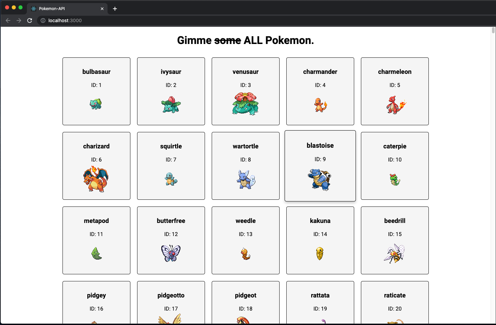

# Practice Assignment "Pokemon-API"

This is Christian Johnson's work for Coding Dojo's Part-Time Accelerated MERN Stack.
It was submitted on April 26, 2023.

## Assignment description

Create a React project that uses the useEffect hook to display the names of all 1010 Pokemon using the Pokemon API.

## Additional Embeleshments

After fulfilling the assignment requirements by following the Learn platform's directions on how to make an api call, I wanted to display an image of each pokemon along with their ID. This information was not available in the initial fetch call-- just the name and a coresponding url. So after a bit of sluething I found that within that initial fetchAllPokemon request you can nest another api call in a `.then` statement. In this second fetch I used the url to retrieve the id (and used it as the key instead of `index`), the name, and the image.

